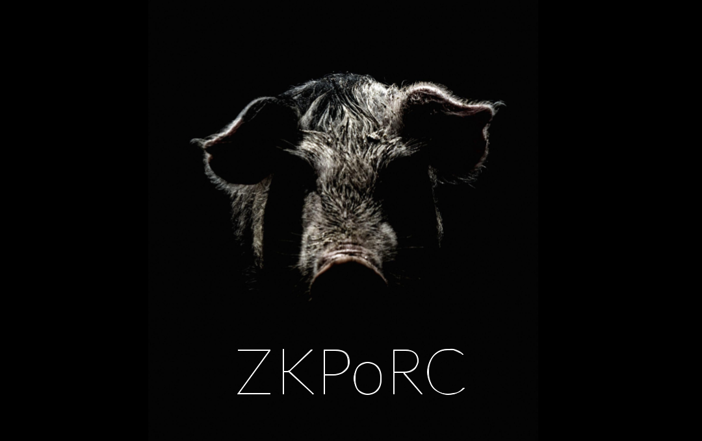

# ZKPoRC(Zero Knowledge Proof of Redeem Code)


```typescript
// Create redeem codes and give them to your friends!
const redeemCode = await builder.generateRedeemCode(msg);

// Your friends will generate zkp to prevent others hijack the redeem codes by watching the tx pool
const proof = await client.proveRedeemCode(claimer.address, redeemCode);

// Now the zk redeem code can be used on the smart contract exclusively :)
await zkporc.verify({
  message: msg,
  signer: builder.scalarPubKey,
  claimer: claimer.address,
  proof,
})
```
